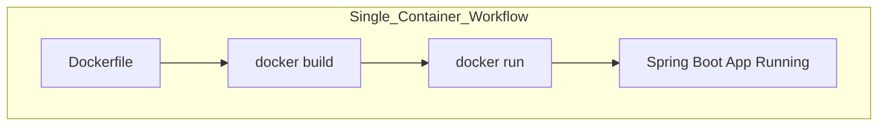
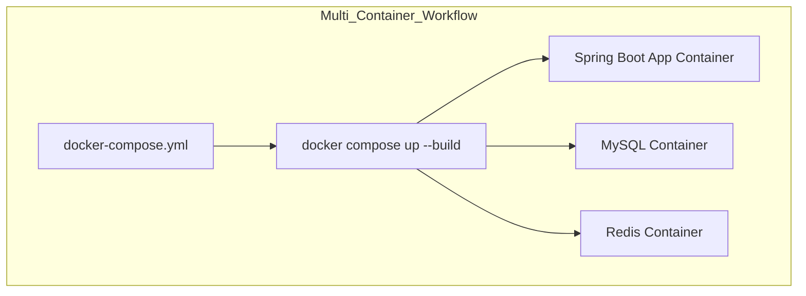

# Dockerize Spring Boot

## Using only docker file

A Dockerfile is used to define how to build a single container image for an application (e.g., a Spring Boot app), specifying the base image, dependencies, and startup command, and it is typically run using Docker commands like docker build and docker run. 

## Using docker compose

In contrast, Docker Compose is used to define and run multiple containers together (such as an app, database, and cache) using a docker-compose.yml file, allowing you to start the entire multi-service application stack with a single command like docker compose up.

